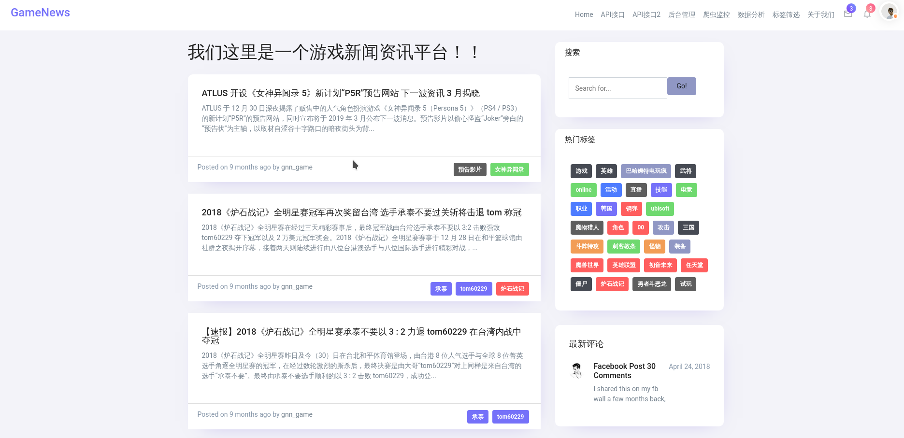

# gamenews

游戏资讯平台前端部分

## 效果图




## 在启动这个项目前

要先启动各个地方的接口

- [ghost-of-fantasy/display-back-end](https://github.com/ghost-of-fantasy/display-back-end)
- [ghost-of-fantasy/monitor](https://github.com/ghost-of-fantasy/monitor)

修改接口.env配置 [src/api/index.js](src/api/index.js)

```
VUE_APP_PRO_HOST='http://plrom.niracler.com:8000'
VUE_APP_TEST_HOST='http://plrom.niracler.com:8002'
VUE_APP_FLASK_HOST='http://plrom.niracler.com:5555'

VUE_APP_DSN='***'
```

## 安装启动(docker)

```shell script
docker-compose build
```

## 安装启动

### Project setup
```shell script
npm install
```

### Compiles and hot-reloads for development
```shell script
npm run serve
```

### Compiles and minifies for production
```shell script
npm run build
```

### Run your tests
```shell script
npm run test
```

### Lints and fixes files
```shell script
npm run lint
```

### Customize configuration
See [Configuration Reference](https://cli.vuejs.org/config/).

## 功能

- 展示新闻文章

## 参考文章

- [vue-cli3出现Invalid Host header的解决方案](https://blog.csdn.net/guzhao593/article/details/85918869)
- [Vue.js 教程](https://www.runoob.com/vue2/vue-tutorial.html)
- [路由组件传参](https://router.vuejs.org/zh/guide/essentials/passing-props.html#对象模式)
- [vue请求中 post get传参方式](https://blog.csdn.net/zhaofuqiangmycomm/article/details/89479904)
- [Nginx 部署Vue前端项目](https://blog.csdn.net/jeikerxiao/article/details/80885875)
- [Quixlab - Free Bootstrap 4 HTML5 Admin Dashboard Template](https://themewagon.com/themes/free-bootstrap-4-html5-admin-dashboard-template-quixlab/)
- [Matrix Admin - Free HTML5 Bootstrap 4 admin dashboard template](https://themewagon.com/themes/free-html5-bootstrap-4-admin-dashboard-template-matrix-admin/)
- [Bootstrap dropdown not working](https://stackoverflow.com/questions/12458522/bootstrap-dropdown-not-working)
- [Bootstrap 4 Timeline](https://www.codeply.com/go/dI6CknFxts/bootstrap-4-timeline)
- [vue 引入公共css文件](https://blog.csdn.net/Smartsunsing/article/details/78529374)
- [Vue 使用 filter 过滤器格式化时间的两种方式](https://juejin.im/post/5d0f08e3f265da1b695d6873)
- [vue技术帖－实现一款简单通用的翻页组件](https://segmentfault.com/a/1190000006911880#articleHeader1)
- [vue组件系列－Tags input](https://segmentfault.com/a/1190000005779273)
- [Dockerize Vue.js App](https://vuejs.org/v2/cookbook/dockerize-vuejs-app.html)
- [Vue项目优化，减小打包体积](https://blog.csdn.net/qq_38948398/article/details/86539011) 36s-18s
- [vue-cli 开启 gzip](https://www.jianshu.com/p/d402c1f7b519) 18s-5s